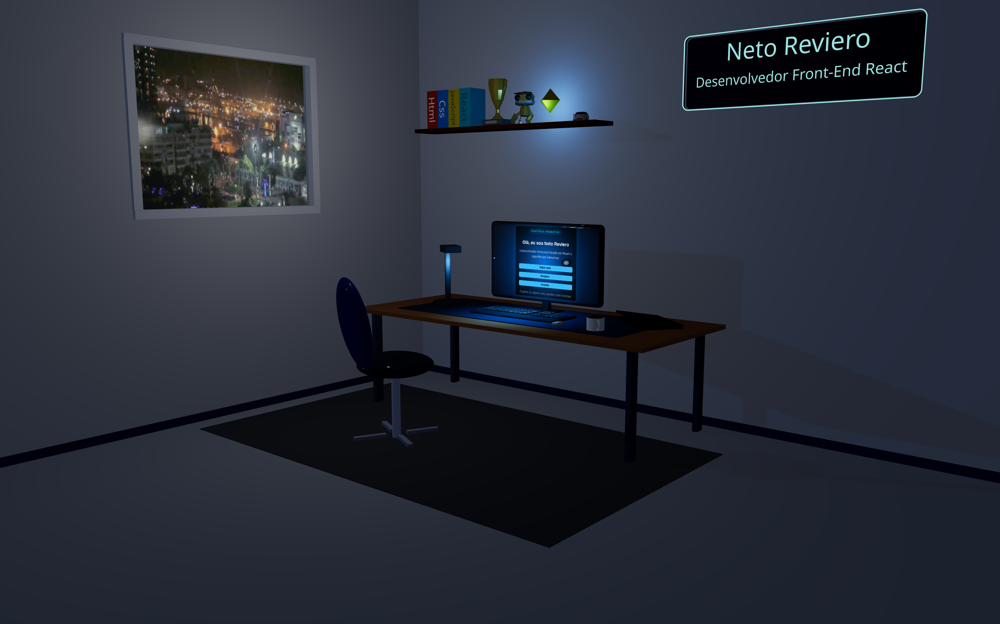
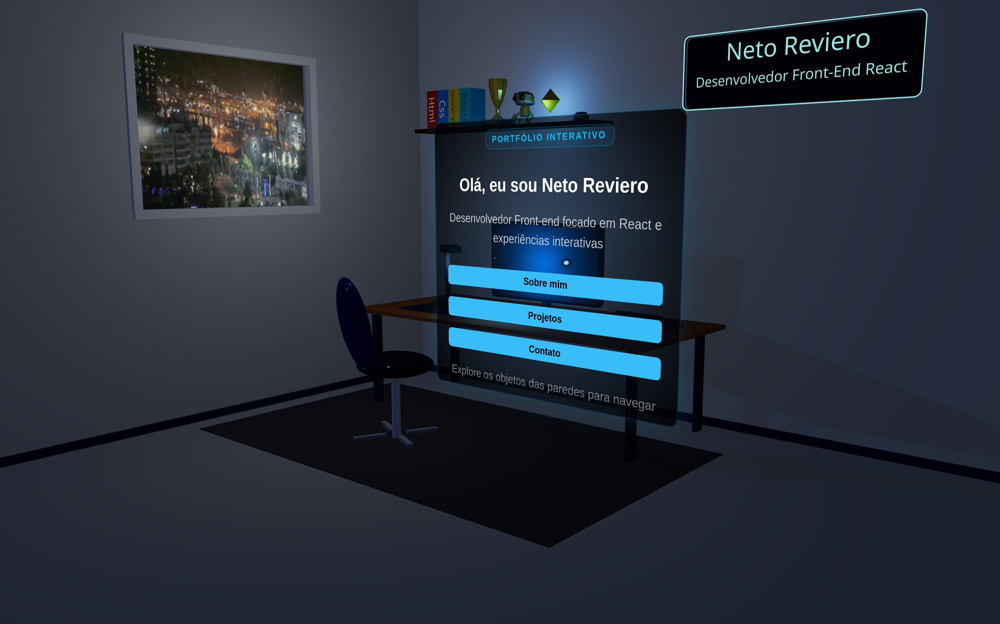

# 🎮 Portfólio 3D Interativo

Um portfólio pessoal desenvolvido com **React**, **React Three Fiber** e **Three.js**, projetado para apresentar meus projetos, habilidades e contatos de forma imersiva e interativa.
A aplicação simula um ambiente 3D estilizado, com objetos clicáveis, monitor interativo, hover dinâmico, iluminação contextual e navegação visual para destacar minha identidade como desenvolvedor frontend.

## 📸 Preview
### Desktop

### Interação no monitor

## ✨ Funcionalidades
- Ambiente 3D interativo com **React Three Fiber**
- Objetos clicáveis com feedback visual
- Monitor com interface HTML integrada à cena 3D
- Seções de:
  - **Sobre mim**
  - **Projetos**
  - **Contato**
- Cards de projetos com imagem e descrição
- Hover com iluminação dinâmica nos objetos
- Navegação imersiva baseada em interação
- Design responsivo
- Interface visual com foco em experiência do usuário

## 🧠 Objetivo do projeto
Este projeto foi desenvolvido com o objetivo de:
- fortalecer minha base em **React aplicado a interfaces interativas**
- praticar integração entre **HTML + CSS + WebGL**
- explorar conceitos de **UX em ambientes 3D**
- construir um portfólio com identidade visual mais forte para o mercado

## 🛠️ Tecnologias utilizadas
### Frontend
- React
- Vite
- JavaScript
- CSS3
### 3D / Interatividade
- Three.js
- React Three Fiber
- @react-three/drei
### Extras
- React Icons
- HTML dentro da cena 3d
---

## 🧩 Principais conceitos aplicados
- Componentização com React
- Gerenciamento de estado para interações
- Eventos de ponteiro em objetos 3D
- Integração entre cena 3D e interface HTML
- Renderização com Canvas/WebGL
- Hover contextual com iluminação dinâmica
- Organização visual de conteúdo em seções interativas

## 📚 Aprendizados
Este projeto foi essencial para consolidar minha evolução como desenvolvedor frontend, principalmente na construção de experiências interativas além do layout tradicional.
Durante o desenvolvimento, aprofundei meus conhecimentos em:
- React aplicado a interfaces interativas e orientadas a estado
- integração entre DOM e cena 3D com React Three Fiber
- gerenciamento de hover, clique e foco em múltiplos elementos da interface
- estruturação de componentes com separação entre lógica visual e comportamento
- composição de experiência do usuário em ambiente imersivo
- refinamento de responsividade e usabilidade em uma interface não convencional
- aplicação prática de iluminação, materiais e feedback visual como recurso de navegação

## 🧪 Desafios técnicos resolvidos
Ao longo do desenvolvimento, enfrentei e resolvi diversos desafios técnicos relacionados à interação entre interface HTML e ambiente 3D, como:
- conflito de hover entre objetos próximos dentro da cena
- propagação incorreta de eventos do mouse no Canvas
- interferência entre elementos HTML sobrepostos e objetos 3D interativos
- ajuste fino do posicionamento da câmera para melhorar enquadramento e navegação
- controle visual de destaque em objetos clicáveis sem comprometer a estética da cena
- refinamento de botões, tooltips e elementos de interface para melhorar a experiência do usuário
- adaptação do conteúdo do monitor para funcionar como uma interface integrada ao ambiente 3D
- organização da estrutura visual e lógica do projeto para facilitar manutenção e evolução

**Desenvolvido por Neto Reviero**
Linkedin: linkedin.com/in/neto-reviero
E-mail: netoreviero@gmail.com
